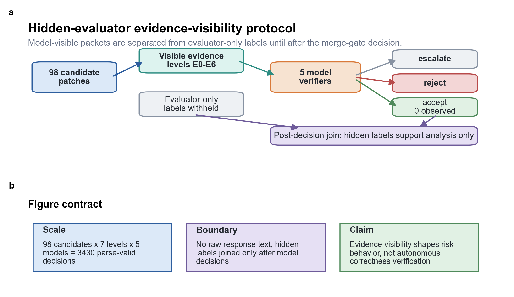
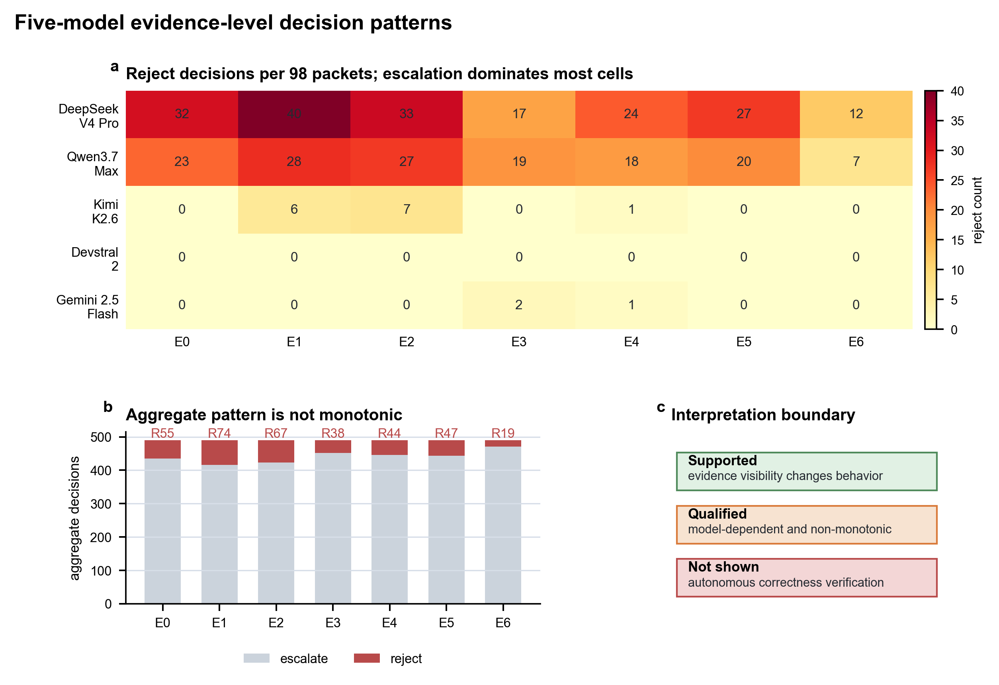
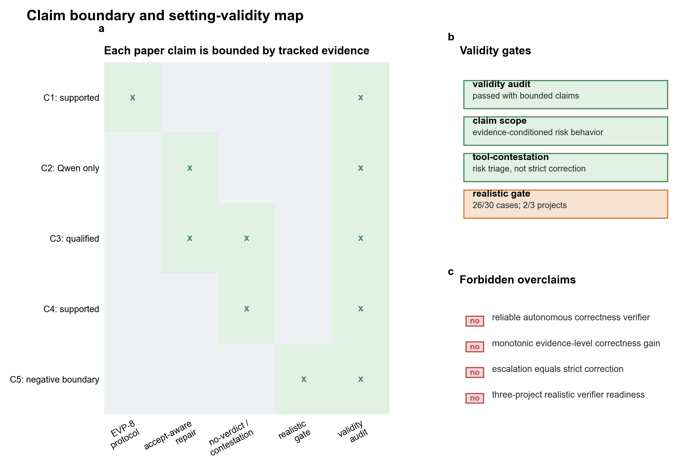

# Evidence Visibility Shapes Risk Behavior in LLM-Based Candidate Patch Verification

Draft status: stable CCF-C manuscript rewrite v0.3, 2026-07-04.

## Abstract

Large language models (LLMs) are increasingly used to inspect software patches, but a merge decision is only meaningful relative to the evidence available at review time. We formulate candidate patch verification as an evidence-conditioned merge-gate task: given a candidate patch and model-visible evidence, a verifier must accept, reject, or escalate while evaluator-only correctness labels remain hidden until post-decision analysis. We introduce the Evidence-Visibility Protocol (EVP-8), a frozen 98-candidate packet set with seven cumulative evidence levels and tracked hidden-evaluator joins. In the repaired Qwen v0.3 run, correct recall is 0.00% at E0-E2, 80.95% at E3, 85.71% at E4-E5, and 95.24% at E6, while E6 accepted precision is 83.33% with 4 false accepts among 77 non-correct candidates. E6 rule-only and no-verdict ablations further show that verdict-like tool summaries can anchor behavior, and tool-contestation shifts known false accepts mainly to escalation, not strict rejection. These results support a bounded methodological contribution: evidence visibility should be controlled and reported when evaluating LLM patch verifiers. They do not establish reliable autonomous patch correctness verification.

## 1. Introduction

Candidate patches generated or reviewed by automated systems can look plausible while remaining incomplete, irrelevant, or unsafe to merge. Prior automated program repair studies have shown that plausible or test-passing patches can still be incorrect [qi_issta_2015_patch_plausibility; legoues_icse_2012_genprog]. This creates a software-quality problem: teams need to decide not only whether a patch resembles a fix, but whether the evidence available at review time is sufficient to accept it. In practice, that evidence may include issue summaries, patch diffs, static checks, visible tests, generated tests, or tool summaries. A verifier that ignores this evidence boundary risks confusing apparent plausibility with correctness.

LLMs are attractive as patch reviewers because they can read code context and produce structured explanations. However, model behavior may depend strongly on what evidence is visible. If a study does not control the model-visible evidence, it becomes difficult to distinguish model capability from evidence presentation, tool-summary anchoring, or prompt-induced caution. This paper therefore treats evidence visibility as the main experimental variable in candidate patch verification.

We study a hidden-evaluator workflow in which model-visible evidence packets are separated from evaluator-only labels. The verifier emits one merge-gate decision: accept, reject, or escalate, following the broader idea that a classifier can reject or abstain when the available evidence is insufficient [chow_tit_1970_reject_option; geifman_el_yaniv_2017_selective_classification]. Correctness labels, hidden oracle outcomes, and failure taxonomy labels are joined only after execution for analysis. This design lets us ask a bounded question: how does evidence visibility shape LLM risk behavior when reviewing candidate patches?

Our central finding is that, once the evidence construction is repaired, visible executable and tool evidence can unlock correct-patch acceptance while exposing a measurable false-accept tradeoff. The result is not evidence that LLMs are reliable autonomous patch correctness verifiers. Instead, it supports a software-quality interpretation: LLM verifiers should be evaluated as evidence-conditioned risk controllers whose behavior can shift toward acceptance, rejection, escalation, or tool-summary dependence depending on the setting.

## 2. Background and Related Work

Patch correctness has long been a central concern in automated program repair and software testing. Generate-and-validate repair systems can produce plausible patches that pass available tests while failing broader semantic expectations, a problem commonly discussed as plausible or overfitting patches [qi_issta_2015_patch_plausibility]. Controlled fault benchmarks and systematic APR studies provide the evaluation context for this problem [just_issta_2014_defects4j; legoues_icse_2012_genprog]. This paper studies the downstream verification side: after a candidate patch exists, what evidence is sufficient for a merge-gate decision?

Testing and oracle research provide the technical basis for exposing the limits of visible evidence. The oracle problem in software testing means that deciding whether observed behavior is correct is itself a non-trivial validity boundary [barr_tse_2015_oracle_problem]. Visible fail-to-pass tests, pass-to-pass regression checks, static diagnostics, and broader tool summaries can each support a reviewer, but none is identical to a hidden evaluator label. The EVP-8 design therefore separates model-visible evidence from evaluator-only outcomes rather than asking an LLM to see or infer the final label.

LLM-based repair and LLM-as-judge studies further motivate the evidence-boundary question. Large pretrained models have been studied as program repair systems and code-editing tools [xia_zhang_icse_2023_llm_apr; tufano_icse_2019_bugfix_nmt], while LLM-as-judge evaluations show that model judgments require controlled protocols and bounded claims [zheng_neurips_2023_llm_judge]. LLMs can summarize code context and produce structured rationales, but their decisions may be shaped by prompt framing, output schema, and authoritative-looking tool verdicts. We therefore evaluate LLM patch verification as a selective decision problem with an explicit escalation option, closer to human-in-the-loop triage and abstention than to proof of semantic correctness.

The distinction from prior benchmark-style repair evaluation is methodological. Existing benchmarks primarily ask whether a system resolves a task. Code review work, by contrast, emphasizes that a merge decision is embedded in a review process rather than reducible to a single test outcome [bacchelli_bird_icse_2013_code_review]. EVP-8 asks how a verifier behaves under controlled evidence visibility after a candidate patch is already available. The contribution is not a new repair algorithm; it is a reproducible protocol and evidence chain for measuring evidence-conditioned risk behavior.

## 3. Evidence-Visibility Protocol

The unit of analysis is a candidate patch reviewed under a predefined evidence packet. Each packet contains only model-visible information for its evidence level, while hidden evaluator labels and oracle outcomes remain unavailable to the model. After the model decision, evaluator-only labels are joined to compute false accepts, correct recall, escalation, and other bounded metrics.

**Figure 1. Hidden-evaluator evidence-visibility protocol.** Model-visible evidence and evaluator-only labels are separated until post-decision analysis. The figure defines the paper's evidence boundary: candidate patches and level-specific evidence are visible to the model, whereas evaluator labels are withheld until post-decision analysis. Source assets: `docs/figures/ccfc/ccfc_fig1_protocol.pdf`, `.svg`, and `.png`.

The EVP-8 packet set contains 98 candidate patches reviewed across seven evidence levels, E0 through E6. Five selected models produced 686 parse-valid decisions each on the frozen packet set. The synthesis supports descriptive per-level decision-pattern reporting for the packet set; it does not support broad claims that one evidence level is universally optimal or that LLMs outperform deterministic baselines.

The evidence levels are cumulative and intentionally transparent:

| level | added model-visible evidence | role in the protocol |
| --- | --- | --- |
| E0 | issue_patch_seed | issue_patch_seed |
| E1 | patch_surface_map | structured_patch_surface |
| E2 | patch_application_static_status | patch_apply_and_static_slots |
| E3 | visible_fail_to_pass_test_evidence | visible_fail_to_pass_tests |
| E4 | visible_pass_to_pass_regression_evidence | visible_pass_to_pass_regression_tests |
| E5 | broader_visible_tool_diagnostics | broader_visible_tool_diagnostics |
| E6 | deterministic_visible_merge_gate_summary | deterministic_visible_tool_summary |

## 4. Experimental Design

The study is organized around four research questions. RQ1 asks whether repaired accept-aware evidence changes label-conditioned Qwen decisions across E0-E6. RQ2 asks whether verdict-like deterministic tool summaries anchor E6 behavior. RQ3 asks whether explicit tool-contestation can make models challenge visible-test-only accept premises. RQ4 asks whether a fresh realistic hard-negative source-acquisition branch is ready to support a main verifier experiment.

The evaluated evidence sources match those questions. First, the accept-aware Qwen v0.3 analysis computes label-conditioned accepted precision, correct recall, false accept rate, false reject rate, and escalation rate after post-execution label join. Second, E6 full, rule-only, and E6 no-verdict comparisons test the effect of verdict-like tool fields. Third, EVP-8-HARD tool-contestation evaluates known false-accept opportunities. Fourth, the realistic hard-negative branch is treated as a source-acquisition gate rather than a main verifier result because it failed the predeclared three-project readiness threshold.

All paper-facing claims are constrained by a final setting-validity audit. That audit verifies run and parse coverage, raw-output-free summaries, post-execution label joins, prompt-boundary checks, and the non-overclaiming of the realistic hard-negative branch. It passed only with bounded claims: the results are usable as real evidence for evidence-conditioned risk behavior, not as proof of autonomous correctness verification. Baselines not yet implemented in tracked artifacts, such as always-escalate, random, and majority policies, are therefore not reported as completed results.

The baseline policy boundary is explicit. Always-escalate, always-reject, and always-accept are deterministic reference policies calculated from aggregate label totals; they orient the decision space but are not successful verifier results. The completed deterministic baseline is the rule-only visible-tool policy. Majority voting across models and a separate E0/no-tool deterministic verifier require candidate-level aligned audits and are not reported as completed baselines.

| policy | status | accept | reject | escalate | paper role |
| --- | --- | ---: | ---: | ---: | --- |
| always_escalate | calculable_from_label_totals | 0 | 0 | 98 | conservative abstention reference, not a useful verifier. |
| always_reject | calculable_from_label_totals | 0 | 98 | 0 | safety-heavy lower-bound reference exposing recall collapse. |
| always_accept | calculable_from_label_totals | 98 | 0 | 0 | unsafe throughput reference exposing base-rate risk. |
| rule_only_visible_tool | completed_existing_tracked_result | 25 | 73 | 0 | main deterministic baseline for E6 full/no-verdict comparison. |

## 5. Results

### 5.1 RQ1: Accept-aware evidence changed Qwen label-conditioned behavior

The repaired Qwen v0.3 accept-aware run provides a direct label-conditioned result on the frozen 98-candidate packet set. Hidden labels were joined only after execution, and the matrix had complete candidate-level coverage with no missing or duplicate cells.

| level | accept | correct accept | false accept | accepted precision | correct recall | false accept rate | escalation rate |
| --- | ---: | ---: | ---: | ---: | ---: | ---: | ---: |
| E0 | 0 | 0 | 0 | n/a | 0.00% | 0.00% | 75.51% |
| E1 | 0 | 0 | 0 | n/a | 0.00% | 0.00% | 75.51% |
| E2 | 0 | 0 | 0 | n/a | 0.00% | 0.00% | 74.49% |
| E3 | 20 | 17 | 3 | 85.00% | 80.95% | 3.90% | 4.08% |
| E4 | 21 | 18 | 3 | 85.71% | 85.71% | 3.90% | 2.04% |
| E5 | 21 | 18 | 3 | 85.71% | 85.71% | 3.90% | 3.06% |
| E6 | 24 | 20 | 4 | 83.33% | 95.24% | 5.19% | 0.00% |

**Figure 2. Accept-aware and no-verdict metric evidence.** Repaired evidence unlocks Qwen correct-patch acceptance while E6 ablations expose verdict-dependent risk tradeoffs. Panel a reports Qwen v0.3 correct recall and false accept rate across E0--E6; panel b compares rule-only, E6-full, and E6-no-verdict conditions; panel c summarizes the current result-chain boundary. Source assets: `docs/figures/ccfc/ccfc_fig2_decision_patterns.pdf`, `.svg`, and `.png`.

This table changes the paper's main interpretation. At E0-E2, Qwen accepted no correct patches, so the setting mainly measured caution. At E3-E6, executable and tool evidence enabled many correct-patch accepts: correct recall rose to 80.95% at E3 and 95.24% at E6. The improvement was not free. E6 accepted 20 of 21 correct patches but also accepted 4 of 77 non-correct patches, giving 83.33% accepted precision and 5.19% false accept rate. The supported claim is therefore not that more evidence monotonically proves correctness; it is that visible evidence can unlock acceptance behavior while exposing a measurable false-accept tradeoff.

### 5.2 RQ2: Verdict-like evidence changed policy behavior

The E6 no-verdict ablation compares a deterministic rule-only baseline, the E6-full setting with verdict-like tool fields, and E6-no-verdict variants that remove those fields. This directly tests whether the model is adding value beyond following a visible tool verdict.

| condition | accept | reject | escalate | accepted precision | correct recall | false accept rate | escalation rate |
| --- | ---: | ---: | ---: | ---: | ---: | ---: | ---: |
| rule-only | 25 | 73 | 0 | 80.00% | 95.24% | 6.49% | 0.00% |
| deepseek/deepseek-v4-pro E6-full | 23 | 75 | 0 | 82.61% | 90.48% | 5.19% | 0.00% |
| deepseek/deepseek-v4-pro E6-no-verdict | 11 | 73 | 14 | 100.00% | 52.38% | 0.00% | 14.29% |
| qwen/qwen3.7-max E6-full | 24 | 74 | 0 | 83.33% | 95.24% | 5.19% | 0.00% |
| qwen/qwen3.7-max E6-no-verdict | 23 | 74 | 1 | 82.61% | 90.48% | 5.19% | 1.02% |

The comparison is model-dependent. Qwen E6-no-verdict remains close to Qwen E6-full, preserving high correct recall but repeating four false accepts. DeepSeek E6-no-verdict removes false accepts on this cohort, but its correct recall drops to 52.38% and escalation rises to 14.29%. The result supports a risk-policy interpretation: removing verdict-like fields can reduce unsafe accepts for some models, but the gain may come from abstention rather than semantic discrimination.

The uncertainty summary reinforces the same boundary. Wilson 95% confidence intervals are wide because the cohort has 21 correct and 77 incorrect candidates, so point-estimate differences should not be overstated. The intervals support bounded comparison and risk reporting rather than a claim of stable LLM superiority over the deterministic baseline.

| condition | accepted precision 95% CI | correct recall 95% CI | false accept rate 95% CI | escalation rate 95% CI |
| --- | ---: | ---: | ---: | ---: |
| rule-only | 80.00% [60.87%, 91.14%] | 95.24% [77.33%, 99.15%] | 6.49% [2.81%, 14.32%] | 0.00% [0.00%, 3.77%] |
| qwen/qwen3.7-max E6-full | 83.33% [64.15%, 93.32%] | 95.24% [77.33%, 99.15%] | 5.19% [2.04%, 12.61%] | 0.00% [0.00%, 3.77%] |
| qwen/qwen3.7-max E6-no-verdict | 82.61% [62.86%, 93.02%] | 90.48% [71.09%, 97.35%] | 5.19% [2.04%, 12.61%] | 1.02% [0.18%, 5.56%] |
| deepseek/deepseek-v4-pro E6-full | 82.61% [62.86%, 93.02%] | 90.48% [71.09%, 97.35%] | 5.19% [2.04%, 12.61%] | 0.00% [0.00%, 3.77%] |
| deepseek/deepseek-v4-pro E6-no-verdict | 100.00% [74.12%, 100.00%] | 52.38% [32.37%, 71.66%] | 0.00% [0.00%, 4.75%] | 14.29% [8.70%, 22.56%] |

### 5.3 RQ3: Tool-contestation supported risk triage, not strict correction

On EVP-8-HARD, tool-contestation covered 47 candidates for both Qwen and DeepSeek. For the known tool false-accept opportunity set, DeepSeek shifted 9 tool false accepts to 9 escalations and 0 strict rejects. Qwen shifted 9 tool false accepts to 8 escalations, with 0 strict rejects and 1 repeated accept. The supported interpretation is therefore risk triage through escalation, not semantic correction of wrong patches.

### 5.4 RQ4: Realistic hard-negative acquisition remained a boundary

The fresh realistic branch produced 26 visible-pass/hidden-fail cases, below the predeclared target of 30, and covered 2 projects rather than the required 3. It is therefore a source-acquisition and gate-readiness negative result, not a verifier-ready main experiment.

## 6. Discussion

The results support a bounded but practically important interpretation. LLM-based patch verifiers are not only functions of model identity; they are functions of the evidence boundary. A model may become conservative, tool-dependent, or saturated depending on how patch evidence is presented. This matters for software quality because a deployment pipeline must decide whether escalation is acceptable, whether tool summaries should be trusted, and when a patch should remain under human review. Human-automation research has long warned that automation can be misused or over-trusted, so the evidence boundary should be reported rather than hidden [parasuraman_riley_1997_automation].

The strongest contribution is methodological rather than algorithmic. EVP-8 makes evidence visibility explicit, separates model-visible information from evaluator-only labels, and forces each result to state whether it measures acceptance, false acceptance, strict rejection, or escalation.

The most important rival explanation is that the observed behavior is a setup artifact. The final setting-validity audit reduces this risk but does not erase all limitations. It shows that run coverage, parse validity, post-execution label joins, prompt-boundary checks, and claim boundaries are in place. It also identifies remaining threats: cohort diversity is limited, prompt formatting can influence behavior, and the realistic three-project hard-negative gate remains blocked.

The realistic hard-negative branch should be read as a boundary result. It demonstrates that constructing fresh visible-pass/hidden-fail cases is feasible but not yet ready as a main verifier experiment because the predeclared three-project gate failed. This negative result is valuable for reproducibility and source-acquisition planning, but it should not be used to strengthen the verifier claim.

The paper should therefore avoid a stronger interpretation. It does not show that LLMs reliably verify patch correctness. It shows that evidence visibility shapes risk behavior in candidate patch verification and that some apparent improvements are better understood as conservative routing rather than correctness proof.

**Figure 3. Claim boundary and setting-validity map.** Supported findings are bounded by leakage controls, protocol repairs, and remaining external-validity threats. The map connects each supported claim to tracked aggregate evidence, separates passed validity gates from the blocked realistic gate, and lists overclaims that the manuscript must not make. Source assets: `docs/figures/ccfc/ccfc_fig3_claim_boundary.pdf`, `.svg`, and `.png`.

## 7. Threats to Validity

Internal validity may be affected by prompt wording, output schema, and evidence formatting. We mitigate this by using frozen packet sets, tracked prompt-boundary audits, raw-output-free summaries, and post-run matrix checks, but the findings remain tied to the evaluated protocol versions.

Construct validity is limited by the accept/reject/escalate decision space and by the evaluator label boundary. The oracle problem means that hidden labels should be treated as post-decision evaluation evidence, not as model-visible truth [barr_tse_2015_oracle_problem]. Escalation is useful as a human-review routing decision, but it is not strict correction. The manuscript therefore separates strict correction from safe handling.

External validity is bounded by the EVP-8 candidate set, the EVP-8-HARD controlled cohort, and the selected models. The realistic hard-negative branch provides useful source-acquisition evidence but did not pass the three-project verifier-readiness gate. We therefore report it as a negative boundary rather than as main verifier evidence.

## 8. Conclusion

This study introduces EVP-8 as a hidden-evaluator protocol for measuring evidence-conditioned LLM patch-verification behavior. The supported results come from repaired Qwen label-conditioned analysis, E6 rule-only/no-verdict ablations, and tool-contestation audits. The practical value is risk triage under explicit evidence boundaries, not reliable autonomous patch correctness verification. A stable CCF-C manuscript should therefore present the work as a bounded methods-and-measurement contribution with transparent metrics, baselines, excluded settings, and threat boundaries.

## Reference Support Records

The current Markdown draft uses citation keys pending final venue-specific BibTeX conversion. The cited support records are:

- `qi_issta_2015_patch_plausibility`: Zichao Qi, Fan Long, Sara Achour, and Martin Rinard. "An Analysis of Patch Plausibility and Correctness for Generate-and-Validate Patch Generation Systems." ISSTA 2015. DOI: 10.1145/2771783.2771791.
- `legoues_icse_2012_genprog`: Claire Le Goues, ThanhVu Nguyen, Stephanie Forrest, and Westley Weimer. "A Systematic Study of Automated Program Repair: Fixing 55 out of 105 Bugs for $8 Each." ICSE 2012. DOI: 10.1109/ICSE.2012.6227211.
- `just_issta_2014_defects4j`: Rene Just, Darioush Jalali, and Michael D. Ernst. "Defects4J: A Database of Existing Faults to Enable Controlled Testing Studies for Java Programs." ISSTA 2014. DOI: 10.1145/2610384.2628055.
- `barr_tse_2015_oracle_problem`: Earl T. Barr, Mark Harman, Phil McMinn, Muzammil Shahbaz, and Shin Yoo. "The Oracle Problem in Software Testing: A Survey." IEEE TSE 2015. DOI: 10.1109/TSE.2014.2372785.
- `xia_zhang_icse_2023_llm_apr`: Chunqiu Steven Xia and Lingming Zhang. "Automated Program Repair in the Era of Large Pre-trained Language Models." ICSE 2023. DOI: 10.1109/ICSE48619.2023.00129.
- `tufano_icse_2019_bugfix_nmt`: Michele Tufano, Cody Watson, Gabriele Bavota, Massimiliano Di Penta, Martin White, and Denys Poshyvanyk. "An Empirical Investigation into Learning Bug-Fixing Patches in the Wild via Neural Machine Translation." ICSE 2019. DOI: 10.1109/ICSE.2019.00064.
- `bacchelli_bird_icse_2013_code_review`: Alberto Bacchelli and Christian Bird. "Expectations, Outcomes, and Challenges of Modern Code Review." ICSE 2013. DOI: 10.1109/ICSE.2013.6606617.
- `chow_tit_1970_reject_option`: C. K. Chow. "On Optimum Recognition Error and Reject Tradeoff." IEEE Transactions on Information Theory 1970. DOI: 10.1109/TIT.1970.1054406.
- `geifman_el_yaniv_2017_selective_classification`: Yonatan Geifman and Ran El-Yaniv. "Selective Classification for Deep Neural Networks." arXiv:1705.08500, 2017.
- `zheng_neurips_2023_llm_judge`: Lianmin Zheng et al. "Judging LLM-as-a-Judge with MT-Bench and Chatbot Arena." NeurIPS 2023. arXiv:2306.05685.
- `parasuraman_riley_1997_automation`: Raja Parasuraman and Victor Riley. "Humans and Automation: Use, Misuse, Disuse, Abuse." Human Factors 1997. DOI: 10.1518/001872097778543886.

## Figure Asset Summary

Figures are placed inline above and generated with the Python/matplotlib backend under `docs/figures/ccfc/`.

- Fig. 1: Hidden-evaluator evidence-visibility protocol — Model-visible evidence and evaluator-only labels are separated until post-decision analysis. Outputs: docs/figures/ccfc/ccfc_fig1_protocol.pdf, docs/figures/ccfc/ccfc_fig1_protocol.svg, docs/figures/ccfc/ccfc_fig1_protocol.png.
- Fig. 2: Accept-aware and no-verdict metric evidence — Repaired evidence unlocks Qwen correct-patch acceptance while E6 ablations expose verdict-dependent risk tradeoffs. Outputs: docs/figures/ccfc/ccfc_fig2_decision_patterns.pdf, docs/figures/ccfc/ccfc_fig2_decision_patterns.svg, docs/figures/ccfc/ccfc_fig2_decision_patterns.png.
- Fig. 3: Claim boundary and setting-validity map — Supported findings are bounded by leakage controls, protocol repairs, and remaining external-validity threats. Outputs: docs/figures/ccfc/ccfc_fig3_claim_boundary.pdf, docs/figures/ccfc/ccfc_fig3_claim_boundary.svg, docs/figures/ccfc/ccfc_fig3_claim_boundary.png.
